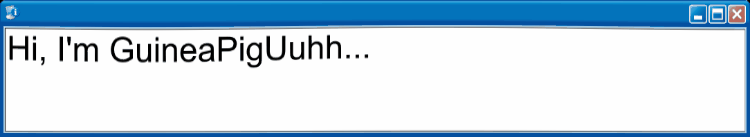

###### I'm an artist and a programmer, feel free to check out my repositories.
---

  
Favorite tools

  

  
Accounts

  
  - [Discord](res/data/Discord.md)
  - [Youtube](https://www.youtube.com/channel/UCdOS2LIS1up0eeE3KNqlgqg)
  - [Gamebanana](https://gamebanana.com/members/2300290)

  
GitHub stats

  

    
  

